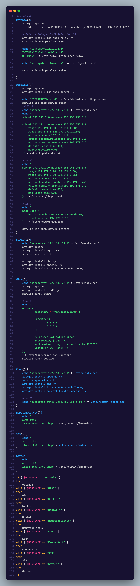
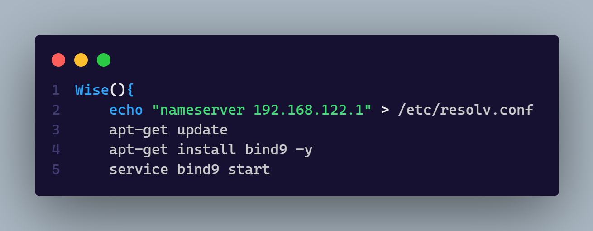
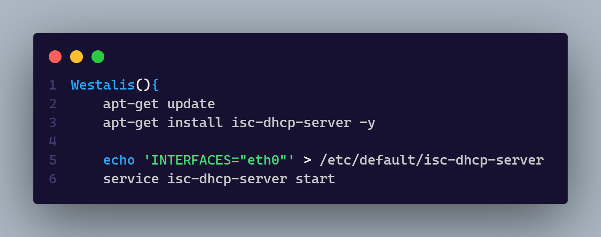
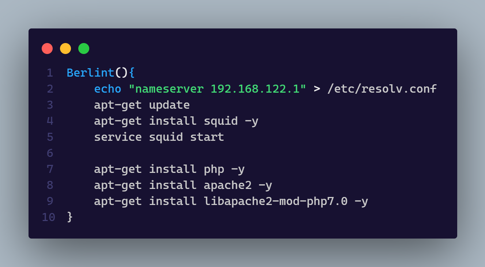
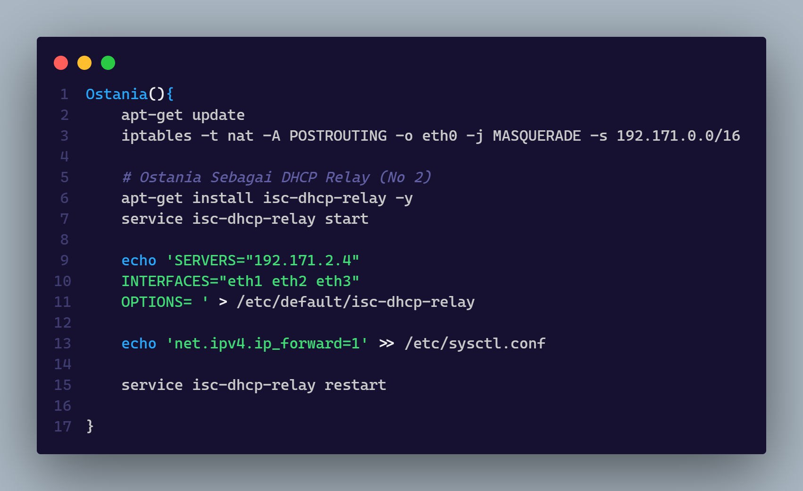
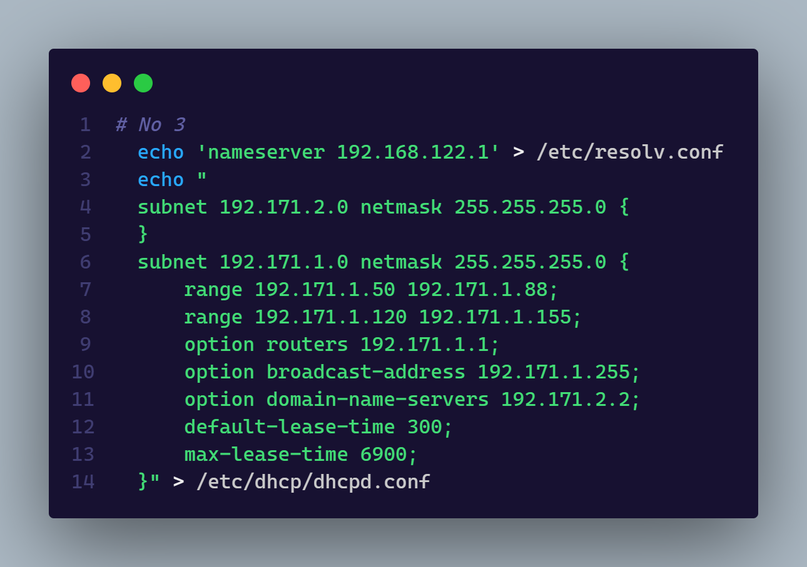
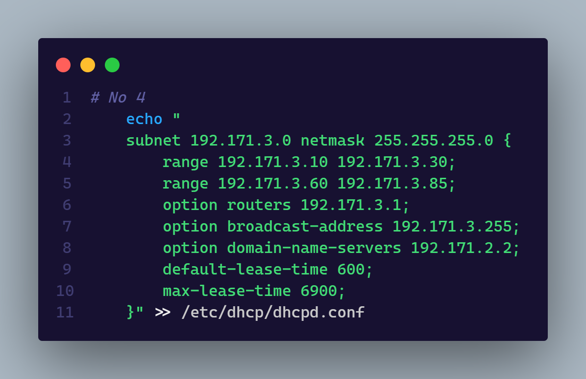
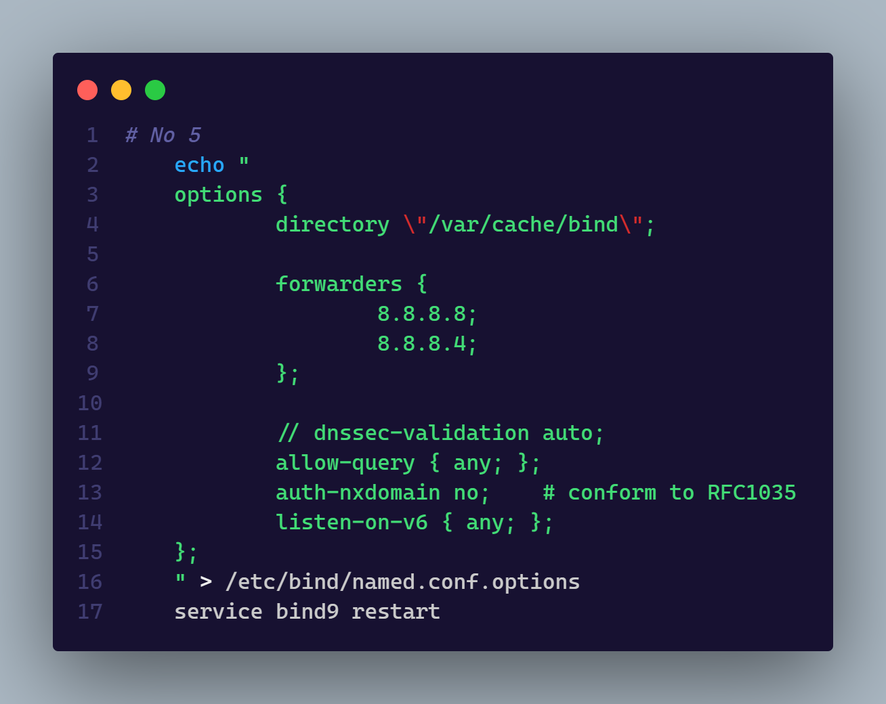
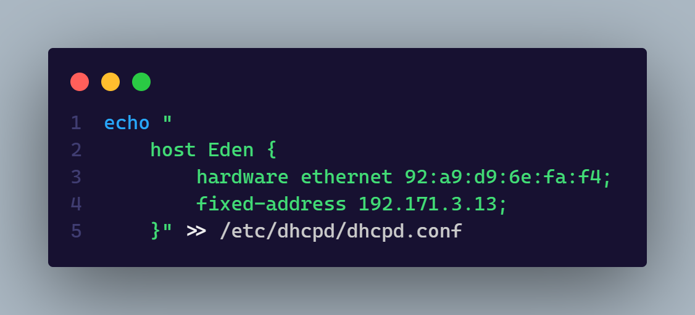
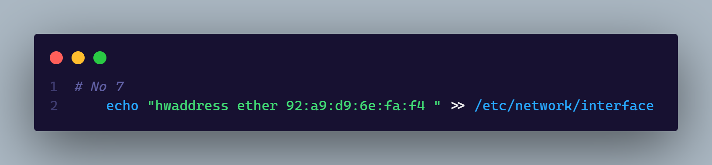

# Kelompok A05

- 5025201020 - Muhammad Ferdian Iqbal
- 5025201039 - Abd. Wahid
- 5025201197 - Abidjanna Zulfa Hamdika
    

### Source Code Full

 

 

### 1. WISE sebagai DNS Server, Westalis sebagai DHCP Server, Berlint sebagai Proxy Server

> Pada soal ini agar node - node sesuai pada soal, perlu konfigurasi pada tiap node seperti gambar tersebut.

 

 

### 2. Ostania sebagai DHCP Relay

> Setelah melakukan konfigurasi agar Ostania dapat terhubung ke jaringan luar, dilanjutkan konfigurasi seperti gambar mulai line 6 agar Ostania dapat menjadi DHCP Relay.

 

 

### 3. Client yang melalui Switch1 mendapatkan range IP dari [prefix IP].1.50 - [prefix IP].1.88 dan [prefix IP].1.120 - [prefix IP].1.155

> Agar soal tersebut dapat terselesaikan, tambahkan konfigurasi pada gambar di node Westalis.

 

 

### 4. Client yang melalui Switch3 mendapatkan range IP dari [prefix IP].3.10 - [prefix IP].3.30 dan [prefix IP].3.60 - [prefix IP].3.85

> Agar soal tersebut dapat terselesaikan, tambahkan konfigurasi pada gambar di node Westalis.

 

 

### 5. Client yang melalui Switch3 mendapatkan range IP dari [prefix IP].3.10 - [prefix IP].3.30 dan [prefix IP].3.60 - [prefix IP].3.85

> Soal tersebut dapat diselesaikan dengan menambahkan konfigurasi sesuai gambar di node Wise.

 

 

### 6. Lama waktu DHCP server meminjamkan alamat IP kepada Client yang melalui Switch1 selama 5 menit sedangkan pada client yang melalui Switch3 selama 10 menit. Dengan waktu maksimal yang dialokasikan untuk peminjaman alamat IP selama 115 menit.

> Konfigurasi pada soal nomor 6 sudah terdapat di gambar soal nomor 3 dan 4

 

 

### 7. Eden sebagai server untuk pertukaran informasi dengan alamat IP yang tetap dengan IP [prefix IP].3.13

> Pada gambar pertama merupakan konfigurasi untuk node Westalis dan gambar kedua adalah konfigurasi untuk node Eden
